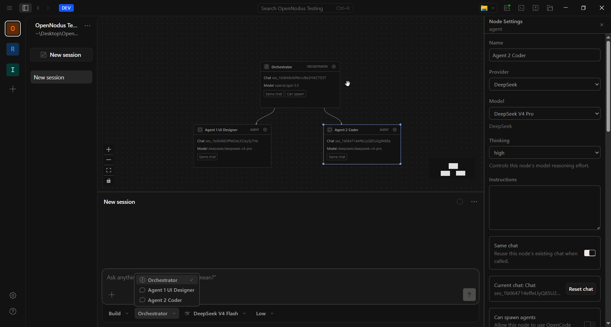

<p align="center">
  
</p>

# OpenNodus

Graph-based AI agent orchestration for the desktop.

OpenNodus is a desktop-focused fork of [OpenCode](https://github.com/anomalyco/opencode). It keeps the desktop app and runtime foundation, then reworks the chat workspace around a visual graph where orchestrators and agents are connected as nodes.

---

### What is different

OpenNodus is being built around multi-agent sessions instead of a single active chat.

- Add Orchestrator and Agent nodes to a session graph.
- Connect nodes visually to define which agents an orchestrator can call.
- Chat with a selected node from the composer.
- Configure each node with its own provider, model, reasoning mode, instructions, permissions, tools, MCP policies, and chat memory.
- Reuse or reset per-node chat context with Same chat mode.
- Detach, clone, and delete nodes from the graph.

### Status

OpenNodus is in active early development. The desktop app builds and runs, and the graph workflow is being expanded incrementally on top of OpenCode's runtime.

### Development

```bash
bun install
bun run --cwd packages/desktop build
```

Set `OPENCODE_CHANNEL=dev` when building development desktop artifacts.

### Building on OpenCode

OpenNodus is an independent fork and is not affiliated with, endorsed by, or maintained by the OpenCode team.

### License

MIT
